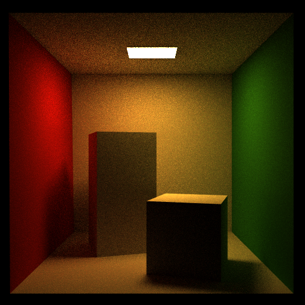
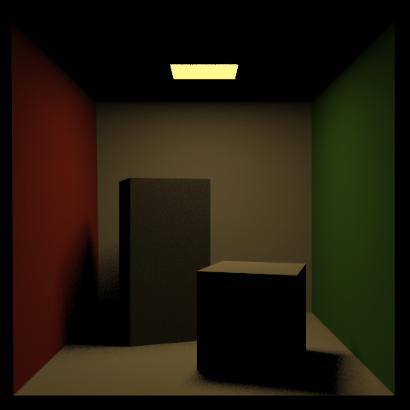
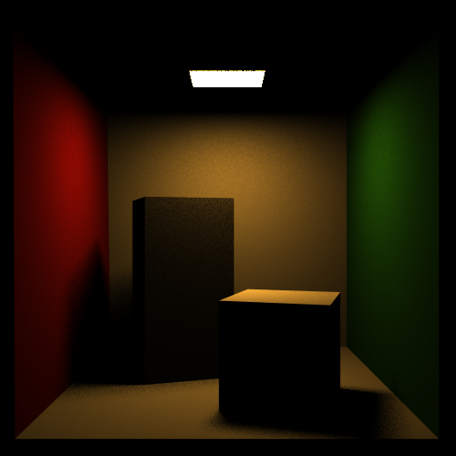
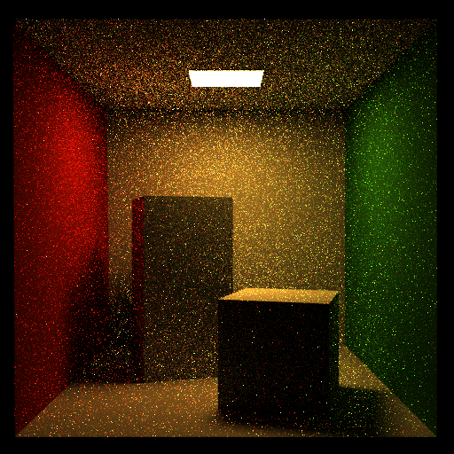
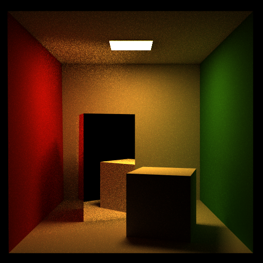
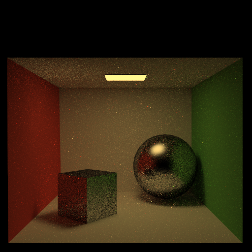
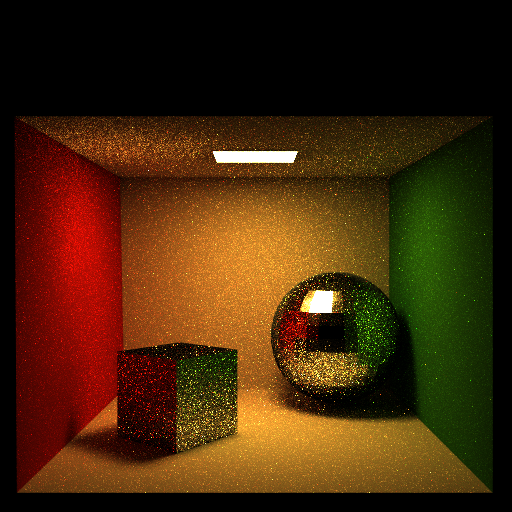
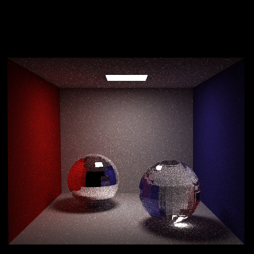
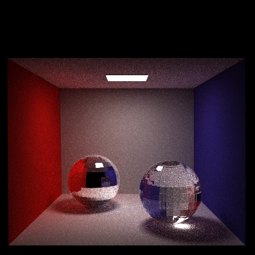

## Path (final submission)

Please fill this out and submit your work to Gradescope by the deadline.

### Output Comparison
Run the program with the specified `.ini` config file to compare your output against the reference images. The program should automatically save to the correct path for the images to appear in the table below.

If you are not using the Qt framework, you may also produce your outputs otherwise so long as you place them in the correct directories as specified in the table. In this case, please also describe how your code can be run to reproduce your outputs

> Qt Creator users: If your program can't find certain files or you aren't seeing your output images appear, make sure to: 
> 1. Set your working directory to the project directory
> 2. Set the command-line argument in Qt Creator to `template_inis/final/<ini_file_name>.ini`

Note that your outputs do **not** need to exactly match the reference outputs. There are several factors that may result in minor differences, such as your choice of tone mapping and randomness.

Please do not attempt to duplicate the given reference images; we have tools to detect this.

| `.ini` File To Produce Output | Expected Output | Your Output |
| :---------------------------------------: | :--------------------------------------------------: | :-------------------------------------------------: |
| cornell_box_full_lighting.ini |   |  |
| cornell_box_direct_lighting_only.ini |   |  |
| cornell_box_full_lighting_low_probability.ini |   |  |
| mirror.ini |   |  |
| glossy.ini |   |  |
| refraction.ini |   |  |

> Note: The reference images above were produced using the [Extended Reinhard](https://64.github.io/tonemapping/#extended-reinhard) tone mapping function with minor gamma correction. You may choose to use another mapping function or omit gamma correction.

### Design Choices
Please list all the features your path tracer implements.

My path tracer implements the four required BRDFs. I used a while loop to calculate contributed weight from each bounce (no recursion on GPU), and my event splitting strategy was to add the direct illumination contributions as the path bounces and then add the indirect illumination contributions at the end (when path terminates on emmisive surface) to prevent double counting. This successfully produces color bleeding and caustics. Another detail with Russian roulette termination involved breaking early from the while loop (after accounting for contributions along-the-way).

For direct illumination, I sampled area light sources by randomly choosing an random emissive triangle and uniformly sampling from said triangle surface using barycentric coordinates. This gives my path tracer soft shadows. 

My tonemapping used 1) the basic Reinhard operator to map my raw radiance values down to the [0, 1] interval and 2) Gamma correction with gamma = 0.1 to get well-displaying colors.

### Extra Features 
Briefly explain your implementation of any extra features, provide output images, and describe what each image demonstrates.

**First**, I implemented this project with WebGPU and WGSL so all of the path tracing computation runs on the GPU and can take advantage of GPU parallelism. Typescript (Javascript) is used to parse and pack the OBJ files into buffers for the GPU program. I also wrote a custom module system to handle multiple .WGSL files that can "#include" each other.

I also wrote a script to generate the BVH and pack it into a linear buffer on the Typescript end, and wrote a BVH traversal function on the WebGPU end which was quite challenging without recursion! I manually managed a stack which is definitely not efficient (the ideal being Morton Code LBVHs but that was too hard...) and so my path tracer honestly isn't that much faster despite the parallelism. 

**Second**, I implemented BRDF importance sampling with cosine-weighted hemisphere sampling. Our BRDF integral always has a cosine term, so if we sample with respect to a cosine-shaped distribution, we expect our Monte Carlo integration to converge faster. First we need the normalized cosine distribution:

$$pdf(\omega)=\frac{cos\theta}{\int cos\theta \:d\omega} = \frac{cos\theta}{\int \int cos\theta \:sin\theta \:d\theta\:d\phi} =\frac{cos\theta}{\pi}$$

So our normalizing factor is $1/\pi$. This is also the PDF we need to divide by. Now we need to use inverse CDF method to sample from the cosine distribition. We express the pdf in terms of our $\phi$ and $\theta$ parameterizations:
$$p(\theta,\phi)=\frac{cos\theta\:sin\theta}{\pi}$$

The distribution does not depend on choice of $\phi$ so per uniform hemisphere sampling, $\phi=2\pi\xi_2$. Then it follows $pdf(\theta)=2\:sin\theta\:cos\theta$. Let's look at $\theta$:

$$cdf(\theta)=\int_0^{\theta} 2\: sin x\:cos x\:dx=sin^2(\theta)=
\xi_1$$

$$\theta=sin^{-1}\sqrt{\xi_1}=cos^{-1}\sqrt{\xi_1}$$

The results indeed show that the cosine-weighted sampling is less noisy than the uniform sampling so it is converging faster!

| Uniform Sampling | Cosine-Weighted Sampling |
|---|---|
|  |  |

**Third**, I implemented the Beckmann microfacet BRDF model. Microfacet surfaces have many tiny normals pointing in all directions that reflect the light. While our diffuse lighting model assumes surfaces scatter light equally, this is not entirely correct. The microfacets of a microfacet surface often have a similar range of slopes and would thus reflect more from certain angles. The Beckmann BRDF is a great starter example where $\alpha$ is a parameter that sets the average slope of our facets:

$$D(\omega)=\frac{\text{exp}[-\text{tan}^2\theta/\alpha^2]}{\pi\alpha^2\text{cos}^4\theta}$$

Let's see the difference in the following render where on the left, the walls are perfectly diffuse surface while on the right, the walls are a microfacet surface:

| Lambertian | Microfacet |
|---|---|
|  |  |

We observe more diffuse interreflection and indirect lighting in certain regions of the scene. This is expected because microfacet surfaces should concentrate their reflectance weight along the slopes of their microfacets rather than directly up through the overall surface normal. So we see a lot more "sideways" color bleeding as shown in the picture.

### Collaboration/References

My main references used were with GPU programming, namely the WebGPU and WGSL W3C specifications: https://www.w3.org/TR/WGSL/, https://www.w3.org/TR/webgpu/. This also involved a lot of GPU BVH traversal: https://developer.nvidia.com/blog/thinking-parallel-part-ii-tree-traversal-gpu/ and https://jacco.ompf2.com/2022/06/03/how-to-build-a-bvh-part-9a-to-the-gpu/.

I referenced PBRT as well. 

I also referenced this Shadertoy for coordinate system construction with one vector: https://www.shadertoy.com/view/7ll3zN.

And I spoke with people at office hours talking about tone mapping ideas, and also referred to the Slack posts!

### Known Bugs

My system does not support area-weighted vertex interpolation. The OBJ files are inconsistent with vertex normals and the indexing scheme was too complicated and so I opted out of implementing this. This resulted in my spheres being quite faceted and looking like disco balls. This does affect my final renders for glossy and refractive examples.  

My glossy BRDF comes out a lot noiser than all my other renders, so I suspect something is off with the way I implemented it. 

Also my BVH traversal is sometimes erroneous and triangles will be missing. 
